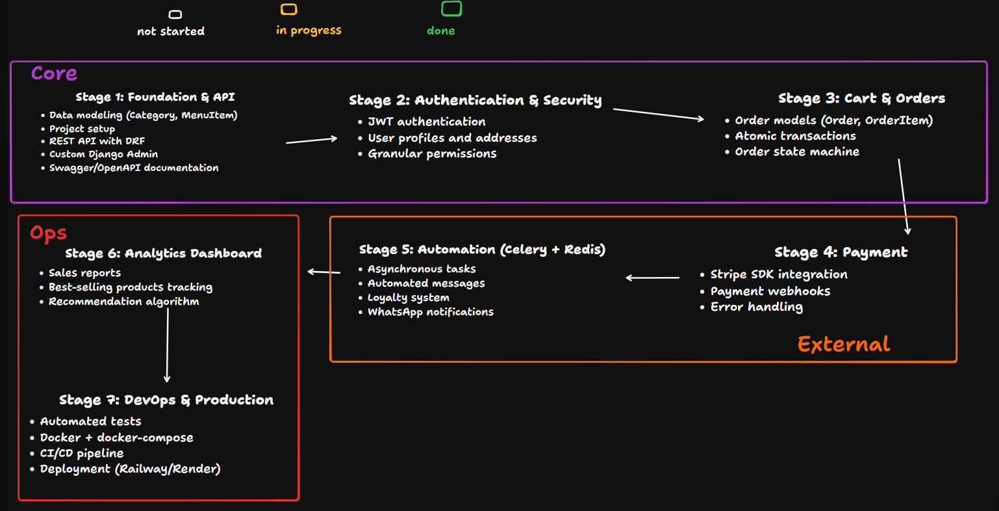
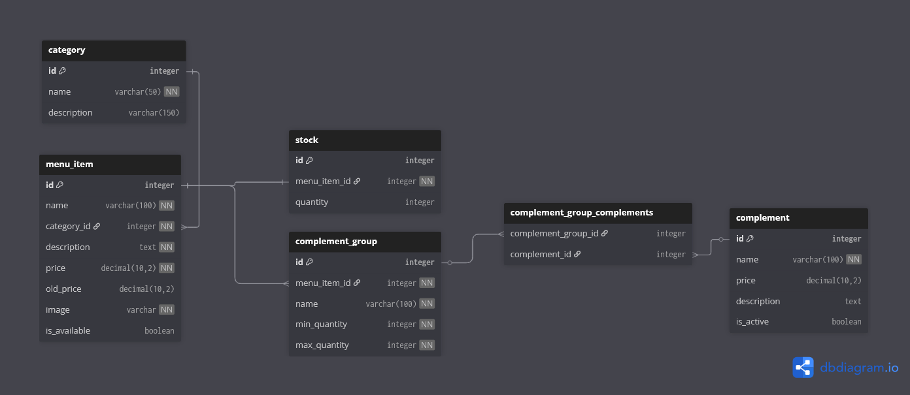

# digital_menu - Cookie Management System
(Literal cookies. Not website cookies.)

A digital menu system built with Django to manage my handmade cookie business in Brazil. Built to replace third-party delivery platforms and eliminate commission costs. 

Developed with Python, Django and PostgreSQL, the system features 14 endpoints, JWT authentication, relational data modeling and Swagger/OpenAPI documentation. The project includes a SQLite to PostgreSQL migration in a production environment, with a roadmap covering Celery, Redis, Stripe, Docker and CI/CD pipeline.

## Roadmap
This project follows a structured approach, divided into logical tiers, from data modeling to DevOps. Below is the high-level roadmap of the project and you can keep up with my progress [here on tldraw](https://www.tldraw.com/f/Y5b2nbWQnTV7kjM88x4iu?d=v-397.-238.2636.1299.page)



I'm also tracking tasks on a Notion Kanban board, where you can see my live workflow.
[👉 View Project Board on Notion](https://www.notion.so/digital_menu-2f77457680e780f5a107d98ab68e2dd1?source=copy_link)

## Visual Database


[👉 Check the Database Diagram](https://dbdiagram.io/d/digital_menu-69aec458cf54053b6f3dcec5)

## Tech Stack

Django 5.1 • Python 3.13 • PostgreSQL • DRF • Git • HTML, CSS and Javascript

## Quick Start
```bash
# Clone the repository
git clone https://github.com/luccatrevisan/digital_menu.git
cd digital_menu

# Create and activate virtual environment
python -m venv venv

# Activate venv (choose your OS):
source venv/bin/activate      # Linux/Mac
venv\Scripts\activate         # Windows (CMD)
venv\Scripts\Activate.ps1     # Windows (PowerShell)

# Install dependencies
pip install -r requirements.txt

# Set up environment variables
cp .env.example .env  # Linux/Mac
copy .env.example .env  # Windows
# Edit .env with your settings

# Run migrations
python manage.py migrate

# Create superuser
python manage.py createsuperuser

# Start server
python manage.py runserver
```

## Key Decisions

**DecimalField for prices:** FloatField has precision errors at scale — even a one-cent discrepancy means incorrect financial data. DecimalField guarantees exact representation for monetary values.
**1:N Category→MenuItem:** Simplicity over flexibility. A single category per item covers the current use case. Can refactor to ManyToMany if the business requires it.
**JWT over DRF's built-in TokenAuthentication:** JWT validates the token by verifying its signature, without hitting the database on every request. Better for scalability and more appropriate for stateless REST APIs.
**SessionAuthentication kept alongside JWT:** Primarily kept for Django Admin compatibility. Not strictly necessary for the API itself, but removing it would break the admin interface authentication flow.
**BearerAuth configured on Swagger:** After protecting endpoints with IsAuthenticated, Swagger required authentication to test routes. Configured BearerAuth on drf-spectacular to allow JWT to be sent via the Authorization header directly from the Swagger UI.
**SQLite → PostgreSQL migration via fixtures:** Used dumpdata to export data to a JSON backup file, manually fixed encoding issues caused by accented characters, then restored with loaddata. Chosen over a direct database dump for simplicity and portability across environments.

## Documentation

Detailed DEVLOGs with decisions, challenges, and learnings (in Brazilian Portuguese): `/docs/devlogs/`

## ✉️ Contact

Lucca - [LinkedIn](https://www.linkedin.com/in/lucca-trevisan-86a181378/) | luccatrevisandev@gmail.com

---
**MIT License • Built with focus on learning and real-world problem solving**
