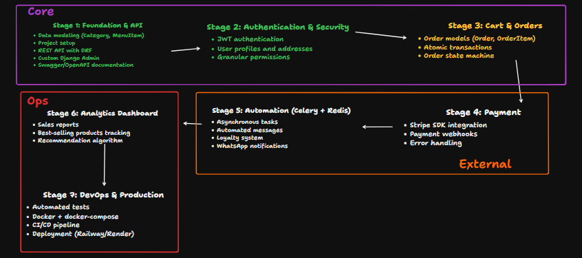

# Digital Menu - Backend API for Real-World Order Management

A backend system built with Django and Django REST Framework to manage a real-world cookie business operation.

This API was designed to replace third-party delivery platforms, reducing operational costs by approximately R$30,000/year and giving full control over orders, products, and business logic.

## Use Case

This system is actively used to support a real business workflow, processing weekly orders and serving as the backend foundation for a live digital menu.

The business context directly influenced the system design, including pricing accuracy, product combinations, and inventory structure.

## Roadmap
Core functionality is already implemented and in use, with ongoing improvements focused on scalability and production readiness.
Below is the high-level roadmap of the project and you can keep up with my progress [here on tldraw](https://www.tldraw.com/f/Y5b2nbWQnTV7kjM88x4iu?d=v-397.-238.2636.1299.page)



I'm also tracking tasks on a Notion Kanban board, where you can see my live workflow.
[👉 View Project Board on Notion](https://www.notion.so/digital_menu-2f77457680e780f5a107d98ab68e2dd1?source=copy_link)

## Visual Database


[👉 Check the Database Diagram](https://dbdiagram.io/d/digital_menu-69aec458cf54053b6f3dcec5)

## Tech Stack

- Python 3.13  
- Django / Django REST Framework  
- PostgreSQL  
- Swagger / OpenAPI  
- Git  

Integrated with a simple frontend (HTML, CSS, JavaScript) for real-world usage.

## Quick Start
```bash
# Clone the repository
git clone https://github.com/luccatrevisan/digital_menu.git
cd digital_menu

# Create and activate virtual environment
python -m venv venv

# Activate venv (choose your OS):
source venv/bin/activate      # Linux/Mac
venv\Scripts\activate         # Windows (CMD)
venv\Scripts\Activate.ps1     # Windows (PowerShell)

# Install dependencies
pip install -r requirements.txt

# Set up environment variables
cp .env.example .env  # Linux/Mac
copy .env.example .env  # Windows
# Edit .env with your settings

# Run migrations
python manage.py migrate

# Create superuser
python manage.py createsuperuser

# Start server
python manage.py runserver
```

## Technical Decisions

- **DecimalField for prices:** FloatField has precision errors at scale — even a one-cent discrepancy means incorrect financial data. DecimalField guarantees exact representation for monetary values.
- **1:N Category→MenuItem:** Simplicity over flexibility. A single category per item covers the current use case. Can refactor to ManyToMany if the business requires it.
- **JWT over DRF's built-in TokenAuthentication:** JWT validates the token by verifying its signature, without hitting the database on every request. Better for scalability and more appropriate for stateless REST APIs.
- **SessionAuthentication kept alongside JWT:** Primarily kept for Django Admin compatibility. Not strictly necessary for the API itself, but removing it would break the admin interface authentication flow.
- **BearerAuth configured on Swagger:** After protecting endpoints with IsAuthenticated, Swagger required authentication to test routes. Configured BearerAuth on drf-spectacular to allow JWT to be sent via the Authorization header directly from the Swagger UI.
- **SQLite → PostgreSQL migration via fixtures:** Used dumpdata to export data to a JSON backup file, manually fixed encoding issues caused by accented characters, then restored with loaddata. Chosen over a direct database dump for simplicity and portability across environments.
- **Custom IsAdminOrReadOnly permission:** Instead of using built-in AllowAny and IsAdminUser per view, created a reusable permission class that varies access based on the HTTP method. GET requests are public, write operations require staff status. Avoids repetition across all viewsets.

## Documentation

Detailed development logs documenting decisions, challenges, and trade-offs (mostly in Brazilian Portuguese): `/docs/devlogs/`

## ✉️ Contact

Lucca - [LinkedIn](https://www.linkedin.com/in/lucca-trevisan-86a181378/) | luccatrevisandev@gmail.com

---
**MIT License • Built with a focus on real-world problem solving, backend architecture, and practical system design.**
