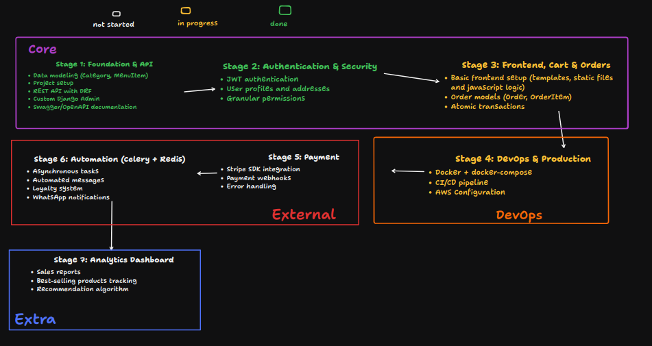
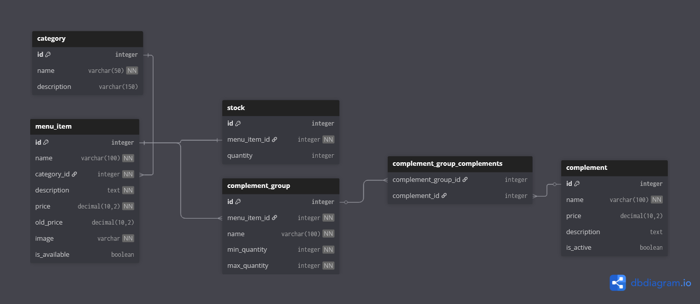

# Digital Menu - Backend API for Real-World Order Management

A backend system built with Django and Django REST Framework to manage a real-world cookie business operation.

This API was designed to replace third-party delivery platforms, reducing operational costs by approximately R$30,000/year and giving full control over orders, products, and business logic.

## Documentation

Detailed development logs documenting decisions, challenges, and trade-offs organized by the roadmap stages (initially in Brazilian Portuguese): [`/docs/devlogs/`](https://github.com/luccatrevisan/digital_menu/tree/main/docs/devlogs)

## Live Demo

The production deployment is currently offline. Now working on CI/CD, Docker and AWS to replace the Railway project.

## Use Case

This system is actively used to support a real business workflow, processing weekly orders and serving as the backend foundation for a live digital menu.

The business context directly influenced the system design, including pricing accuracy, product combinations, and inventory structure.

## Roadmap
Core functionality is already implemented and in use, with ongoing improvements focused on scalability and production readiness.
Below is the high-level roadmap of the project and you can keep up with my progress [here on tldraw](https://www.tldraw.com/f/Y5b2nbWQnTV7kjM88x4iu?d=v-397.-238.2636.1299.page)



I'm also tracking tasks on a Notion Kanban board, where you can see my live workflow.
[👉 View Project Board on Notion](https://www.notion.so/digital_menu-2f77457680e780f5a107d98ab68e2dd1?source=copy_link)

## Visual Database


[👉 Check the Database Diagram](https://dbdiagram.io/d/digital_menu-69aec458cf54053b6f3dcec5)

## Tech Stack

- Python 3.13  
- Django / Django REST Framework (DRF)
- PostgreSQL 
- JWT Authentication
- Swagger / OpenAPI  
- Railway

Integrated with a simple frontend (HTML, CSS, JavaScript) for real-world usage.

## Quick Start
```bash
# Clone the repository
git clone https://github.com/luccatrevisan/digital_menu.git
cd digital_menu

# Create and activate virtual environment
python -m venv venv

# Activate venv (choose your OS):
source venv/bin/activate      # Linux/Mac
venv\Scripts\activate         # Windows (CMD)
venv\Scripts\Activate.ps1     # Windows (PowerShell)

# Install dependencies
pip install -r requirements.txt

# Set up environment variables
cp .env.example .env  # Linux/Mac
copy .env.example .env  # Windows
# Edit .env with your settings

# Run migrations
python manage.py migrate

# Create superuser
python manage.py createsuperuser

# Start server
python manage.py runserver
```

## Technical Decisions

- **Service Layer for Order Creation:** Extracted order creation into a dedicated service to keep views focused on HTTP concerns and centralize business logic such as order item creation, total calculation, and stock updates.
- **Atomic Transactions and Row Locking:** Used `transaction.atomic()` and `select_for_update()` during order creation to prevent partial orders and race conditions when multiple orders attempt to consume the same stock concurrently.
- **DecimalField for Monetary Values:** Used DecimalField instead of floating-point types to guarantee exact monetary calculations and prevent precision errors in prices and order totals.
- **SQLite → PostgreSQL Migration:** Migrated the application database from SQLite to PostgreSQL to better reflect the production environment and support a more robust relational database setup.
- **JWT Authentication:** Chose JWT authentication for the REST API to provide stateless authentication and separate API authentication from Django's session-based admin interface.
- **Structured API Errors:** Implemented machine-readable error codes alongside human-readable messages, allowing the frontend to handle business errors independently from their displayed text.
- **MVP-Driven Architecture:** Removed the Order State Machine after identifying that it introduced complexity before the notification system required to use it. Kept the order flow focused on the core requirement: reliably creating and processing orders.
- **User-Owned Resources:** Designed the Addresses API so authenticated users can only access and manage their own addresses, enforcing ownership at the backend rather than relying on frontend restrictions.
- **Reusable Permissions:** Created a custom IsAdminOrReadOnly permission to centralize access rules for resources that are publicly readable but restricted for write operations, avoiding duplicated permission logic across views.
- **API Documentation and Authentication:** Configured Swagger/OpenAPI with Bearer authentication so protected endpoints can be tested directly through the API documentation interface.

## ✉️ Contact

Lucca - [LinkedIn](https://www.linkedin.com/in/luccatrevisan/) | luccatrevisandev@gmail.com

---
**MIT License • Built with a focus on real-world problem solving, backend architecture, and practical system design.**
