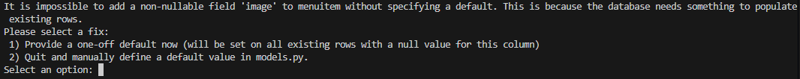

template:
## 23/01/2026 - Melhorando models.py com ImageField

### Objetivo do dia
Implementar o atributo image no model de MenuItem para que os itens do cardápio tenham fotos.

### O que implementei
- ImageField
```python
    class MenuItem(models.Model)
        image = models.ImageField(upload_to='menu_photos', blank=False, null=False)
```
- settings.py
```python
    # Media Files
    MEDIA_ROOT = os.path.join(BASE_DIR, "media")
    MEDIA_URL = "media/"
```
- urls.py
```python
    urlpatterns = [
    path('admin/', admin.site.urls),
    ] + static(settings.MEDIA_URL, document_root=settings.MEDIA_ROOT)
```

### Decisões
- **Como escolhi o caminho de 'upload_to' no ImageField:**
  Na documentação do Django, o exemplo que usam utiliza o caminho "uploads/%Y/%m/%d/" que permite organizar as fotos por data, primeiro por dia, depois mês e, de forma mais abrangente, por ano. Acho interessante para projetos que utilizariam muitas fotos em uma frequência alta mas, para esse projeto, vale mais a pena só organizar uma única pasta, já que, para o MEU cardápio, vou escolher apenas uma foto e seguir com ela por um tempo bem longo. No momento atual, inclusive, tenho alguns itens que têm a mesma foto desde o começo dos tempos. Talvez dê pra separar por categoria, mas adicionaria um certo nível de complexidade que não precisa no momento. Pode ser algo interessante de implementar no futuro. 

  OBSERVAÇÃO: Se esse código, eventualmente, virar um SaaS que atende várias outras lojas, não só a minha, as mídias de todas as lojas ficariam no mesmo lugar sem organização nenhuma. 'upload_to' pode receber funções como valor também, além do caminho em string.

- **Função static() em urlpatterns:**
    Inicialmente, tinha utilizado uma condicional (if settings.DEBUG) para usar a função static. Porém, depois de ver na documentação, vi que esse método já é apenas considerado se DEBUG=True e preferi evitar escrever código redundante. Se ele fosse usado em produção e considerando uma escala grande, o Django estaria encarregado de enviar todas as fotos de 'media' para os usuários e o site ficaria lento. Isso é resolvido através de mecanismos do servidor onde o projeto estaria hospedado. Mais complexo. 

    Explicação extra: urlpatterns é uma lista de urls que servem para chamar uma view (views.py). Como seria muito trabalhoso fazer uma view para cada imagem cadastrada pelo usuário, utiliza-se static(). Esse método retorna uma lista (por isso a SOMA com urlpatterns) de urls configuradas para os arquivos de mídia.

### Desafios
1. 
   - **Como resolvi:** Apesar de ler e entender, não tive a intuição de lembrar que eu já tinha populado o banco de dados antes de adicionar o atributo 'image' para testar o código. Bastava pressionar 1 e deixar o atributo com valor vazio ('') no dado que eu tinha criado. Porém, no fim das contas, preferi só apagar os dados criados anteriormente já que eram apenas testes. Fiz isso através no shell com os comandos 'py manage.py shell' e 'Category.objects.all().delete()' (o objeto ItemMenu criado estava com delete cascade).

### Referências
- https://docs.djangoproject.com/en/6.0/ref/models/fields/#django.db.models.FileField.upload_to
- https://docs.djangoproject.com/en/6.0/ref/settings/#std-setting-MEDIA_ROOT
- https://docs.djangoproject.com/en/6.0/ref/models/fields/#imagefield
- https://docs.djangoproject.com/en/6.0/ref/urls/#static
- https://docs.djangoproject.com/en/6.0/topics/http/urls/
- https://docs.djangoproject.com/en/6.0/howto/static-files/
- https://pypi.org/project/pillow/
- https://medium.com/@michal.drozdze/django-how-to-store-user-files-in-aws-s3-bucket-795d7c21b0c2

---