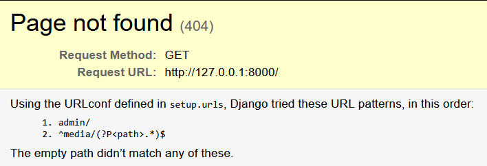

## 27/01/2026 - Configurações Iniciais do Admin

### Objetivo do dia
Pra começar a semana de um jeito tranquilo, preferi fazer uma configuração básica do Django Admin. Porém, me deparei com um erro nas urls (print do erro na seção "Desafios", mais abaixo). Quando fui testar as mudanças que fiz no código com admin, rodei o server e, na hora de acessar o projeto no localhost, me deparei com o erro antes. Não cheguei a testar se poderia só colocar '/admin/' no final da URL que eu acabava indo pro admin, mas preferi corrigir isso logo e começar a ver um pouco das views e das urls.

### O que implementei
- Class CategoryAdmin
```python
    class CategoryAdmin(admin.ModelAdmin):
        list_display = ["id", "name", "description"]
        search_fields = ["id", "name"]
        list_filter = ["id", "name"]

    admin.site.register(Category, CategoryAdmin)
```
- Class MenuItemAdmin
```python
    class MenuItemAdmin(admin.ModelAdmin):
    list_display = ["id", "image", "name", "category", "price"]
    search_fields = ["id", "name", "category"]
    list_filter = ["id", "name", "category", "price"]

admin.site.register(MenuItem, MenuItemAdmin)
```
- Função home para url vazia ('')
```python
    def home(request):
    return HttpResponse("Projeto em construção. Acesse /admin/")
```

### Decisões
- **Configurações do Admin:**
  Preferi manter as configurações simples, por enquanto, com list_display, search_fields e list_filter em ambas classes. Category é um model mais simples e não exigiu tanta atenção. Porém, em MenuItem, acabei escolhendo como parâmetros para list_filter o id, name, category e price para conseguir analisar melhor o cardápio futuramente. Pode ser útil pra ver como estão os preços, quais categorias tem mais produtos ou, com id, ver qual foi criado há menos tempo.

- **Função home:**
  Montei uma função simples somente para preencher a url inicial (vazia) e evitar o erro. Queria dar destaque para o uso de HttpResponse porque, inicialmente, pensei em utilizar render, mas, depois de algumas pesquisas, vi que render exigia um template como parâmetro - algo que não tenho ainda. O HttpResponse permite colocar um texto simples na tela e acabei priorizando ele (links da documentação marcados com asterisco na seção de referências).

### Desafios
1. Erro em urls.py
   - 
   - **Como resolvi:** Inicialmente, pensei que o problema estava na configuração da função static() agregada com o urlpatterns em setup.urls. Quando vi que estava configurado corretamente, busquei informações na documentação e no stackoverflow relacionadas com o MEDIA_ROOT, achando que o problema estava na configuração (settings.py). Acabei consultando o Claude (Inteligência Artificial), passando o print acima, para me ajudar a configurar. No fim das contas, o problema - segundo ele - era que faltava uma view vazia. Aparentemente, o erro só aparecia porque eu ainda não montei a página inicial. Apenas isso. Se eu colocasse '/admin/' no final da url, poderia acessar a página de administração normalmente.

### Referências
- https://docs.djangoproject.com/en/6.0/ref/contrib/admin/
- https://docs.djangoproject.com/en/6.0/ref/contrib/admin/filters/#modeladmin-list-filters
- https://stackoverflow.com/questions/5517950/django-media-url-and-media-root
- https://docs.djangoproject.com/en/4.2/topics/http/urls/#including-other-urlconfs
- https://docs.djangoproject.com/en/6.0/topics/http/views/
- https://docs.djangoproject.com/en/6.0/topics/http/shortcuts/#render *
- https://docs.djangoproject.com/en/6.0/ref/request-response/#django.http.HttpResponse *

---
